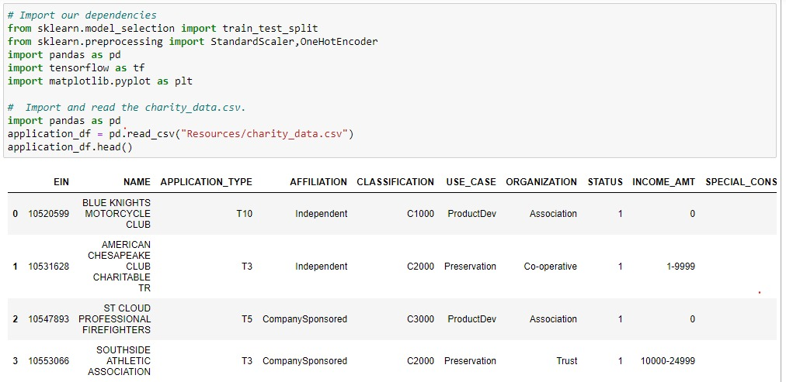
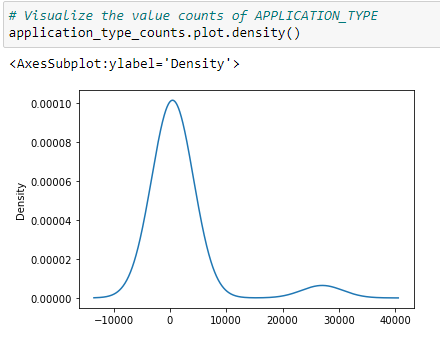
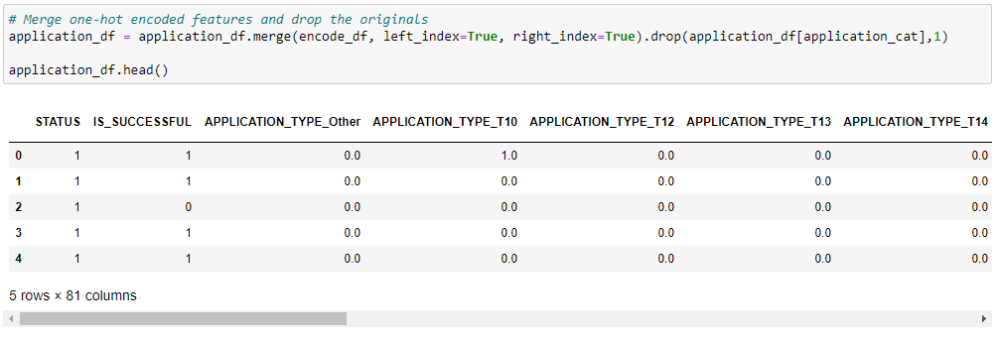
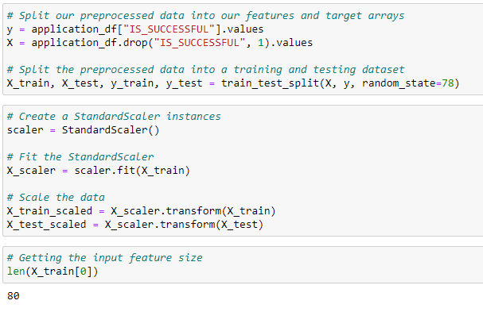
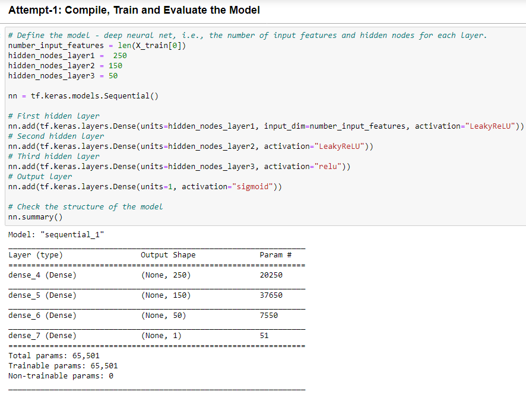
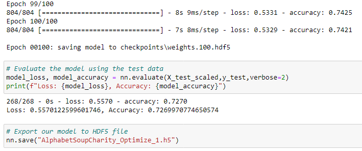
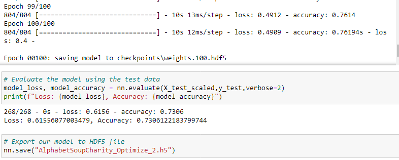
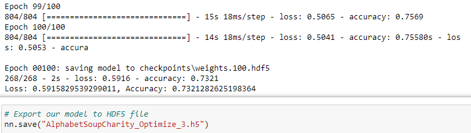

# Neural_Network_Charity_Analysis

## Overview of the Analysis

The purpose of this analysis is to create a binary classifier that is capable of predicting whether applicants will be successful if funded by the charity organization *Alphabet Soup*. 

  ### Data Source and Features
  
The analysis will be based on a dataset as a *.csv* file containing more than **34,000 organizations** that have received funding from Alphabet Soup over the years. Within this dataset are a number of columns that capture metadata about each organization, such as the following:

  - **EIN** and **NAME**—Identification columns
  - **APPLICATION_TYPE**—Alphabet Soup application type
  - **AFFILIATION**—Affiliated sector of industry
  - **CLASSIFICATION**—Government organization classification
  - **USE_CASE**—Use case for funding
  - **ORGANIZATION**—Organization type
  - **STATUS**—Active status
  - **INCOME_AMT**—Income classification
  - **SPECIAL_CONSIDERATIONS**—Special consideration for application
  - **ASK_AMT**—Funding amount requested
  - **IS_SUCCESSFUL**—Was the money used effectively
 
 ## Results
 
  ### Data Preprocessing
  
  As mentioned earlier there are a total of **12 columns** in the *charity_data.csv* file. Fig. 1 shows the imported dependencies and part of the **application_df** dataframe with data from *charity_data.csv*. 
  
  
  
  
  Fig. 1. The imported dependencies and the *application_df* dataset.
  
  The **EIN** and **NAME** columns seems to have no impact on the decision making of whether an applicant for funding will be successful or not. 
  
   ### Target and Features for the model
    
   Looking at the *application_df* DataFrame, we can identify the **IS_SUCCESSFUL** column as the **target (y)** and rest of the **columns (except *non-beneficial ID* or redundant columns) as features (X)**.
   
   Columns having more than 10 unique values have been identified and using a **density plot** (as shown in Fig. 2) *rare* categorical variables are grouped together (i.e., **binning/bucketing**) as a new column *other*.
   
   
   
   Fig. 2. The density plot of the *application_type_counts* to understand the distribution of counts for *binning*.
   
   The *categorical variables* have been encoded using **OneHotEncoding** method and the encoded dataframe is *merged* with the original dataframe while replacing the original columns as shown below.
   
   
   
   Fig. 3. The categorical variables are encoded and merged with original *application_df* replacing original un-encoded variables.
   
   ### Compiling, Training, and Evaluating the Model
   
   After pre-processing of the data, the final *application_df* dataset has been split into *training* and *testing* dataset and got them *scaled* as shown below.
   
   
   
   Fig. 4. Splitting the preprocessed data into *train* and *test* data which later be *scaled* using *StandardScaler* method.
   
   As a **first attempt**, the deep neural net is designed with 3 layers (Fig. 5). From fig. 4, it looks like tha the **input feature size** is **80**. As a thumbrule, the first layer is selected to have **250 neurons** (almost 3 times of input data), second layer **150**, and third layer **50 neurons**. Number of neurons decreased gradually. 
   
   First two layers are assigned with **LeakyReLU** activation function assuming it could process any negative input, the third layer has **relu** and the output layer has **sigmoid** activation functions as shown below in fig. 5.

Fig. 5. Defining the deep neural network with layers, neurons and activation functions.

Next, the model is **compiled** and **trained** with training data creating **CheckPoint Callbacks** within *tensorflow.keras* as shown in fig. 6 below.

Fig. 6. Compile, train the data and saving the checkpoints using callbacks.

### First Optimization Attempt - features, accuracy and loss for the model

- Deleting both the "EIN" and "NAME" columns.
- *application_counts* bin-size < 3 
- input layer feature size = 80 and **3 hidden layers**
- hidden_nodes_layer1 =  250
- hidden_nodes_layer2 = 150
- hidden_nodes_layer3 = 50
- first and second layer activation function = "LeakyReLU", third layer = "relu" and output layer = "sigmoid"

**accuracy = 72.69%**

### Second Optimization Attempt - features, accuracy and loss for the model

- Keeping the "EIN" and deleting the "NAME" column.
- *application_counts* bin-size < 2 
- input layer feature size = 84 and **4 hidden layers**
- hidden_nodes_layer1 =  200
- hidden_nodes_layer2 = 100
- hidden_nodes_layer3 = 50
- **hidden_nodes_layer4 = 10** ; *additional hidden layer in this attempt*
- All activation function = "relu" except output = "sigmoid"

**accuracy = 73.06%**

### Third Optimization Attempt - features, accuracy and loss for the model

- Keeping the "EIN" and deleting the "NAME" column.
- *application_counts* **bin-size < 2** 
- input layer feature size = 84 and 4 hidden layers
- hidden_nodes_layer1 =  **250** ; *increased number of neurons*
- hidden_nodes_layer2 = **150** ; *increased number of neurons*
- hidden_nodes_layer3 = 100
- hidden_nodes_layer4 = 50
- first, second, third activation function = "**LeakyReLU**", fourth layer = "**relu**" and output layer = "**sigmoid**"

**accuracy = 73.21%**

## Summary

Since the first attempt failed to achieve the target accuracy of 75%, two more steps have been taken to optimize the model by adopting various options as described in the previous section. It has been observed that *relu* is better for all layers except the output layer. Adding more hidden layers has higher impact on model metrics that increasing number of neurons. In our model, we need to utilize as many features as possible from the input dataset.

From the resutls obtained from three optimization attempt show that the **model accuracy slightly improved in each attempt** (i.e., from 72.69% to 73.21%) but it still is a little short of the target accuracy of 75%. 

#### Contact

m.a.moonem@gmail.com
